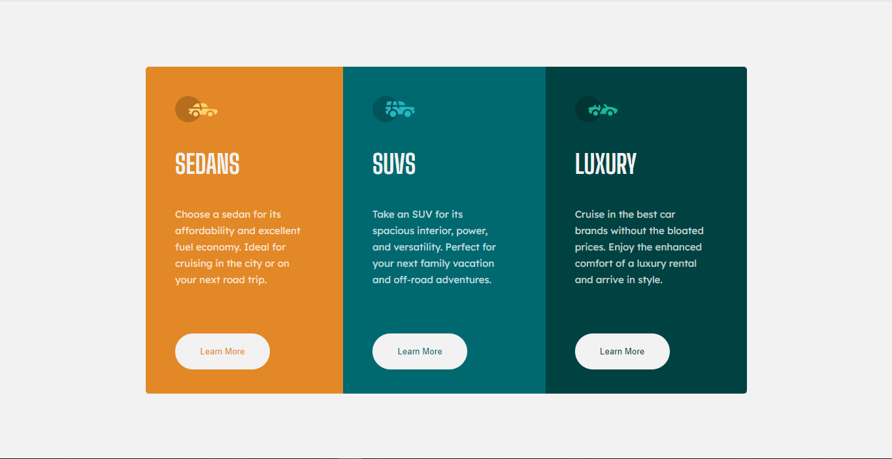
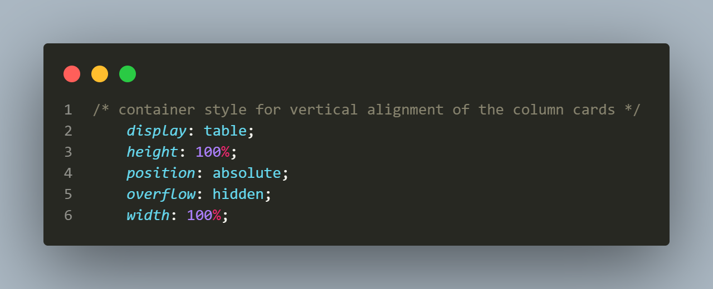
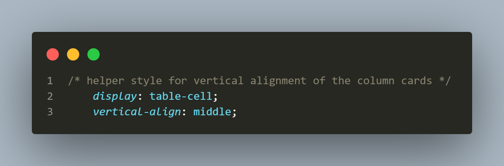

# 3-column-preview-card-component
This is a solution to the [3-column preview card component challenge on Frontend Mentor](https://www.frontendmentor.io/challenges/3column-preview-card-component-pH92eAR2-). Using CSS Flexbox

## Table of contents

- [Overview](#overview)
  - [The challenge](#the-challenge)
  - [Screenshot](#screenshot)
  - [Links](#links)
- [My process](#my-process)
  - [Built with](#built-with)
  - [What I learned](#what-i-learned)
  - [Useful resources](#useful-resources)
- [Author](#author)


## Overview

### The challenge

Users should be able to:

- View the optimal layout depending on their device's screen size
- See hover states for interactive elements

### Screenshot



This is a screenshot of my solution.

### Links

- [View my solution on frontend mentor]( https://www.frontendmentor.io/solutions/responsive-3column-card-preview-component-using-css-flexbox-UqC56qeSUp)
- Live Site URL: [View my live project](https://heroic-concha-36d5b9.netlify.app/)

## My process

1. The first thing I did was to Initialize the project as a public repository on [GitHub](https://github.com/).
2. Then I configured the repository to publish my code to a web address.
3. I Looked through the designs to start planning out how I'll tackle the project. This step was crucial in helping me think ahead for CSS classes to create reusable styles.
4. Before adding any styles, I structured my content with HTML so that I can focus my attention on creating well-structured content.
5. I Wrote out the base styles for the project, including general content styles, such as `font-family` and `font-size`.
6. Finally I Started adding styles to the page.

### Built with

- Semantic HTML5 markup
- CSS custom properties
- Css functions and variables
- Flexbox
- Desktop-first workflow


### What I learned

I learnt how to vartically align dynamic height elements on a page so that they can be centered using the code below.

I am proud of this css code.

```css
body {
    /* container style for vertical alignment of the column cards */
    display: table;
    height: 100%;
    position: absolute;
    overflow: hidden;
    width: 100%;
}

#main-container {
    /* helper style for vertical alignment of the column cards */
    display: table-cell;
    vertical-align: middle;
}
```
I love this code so much that I took a snap shot of it. It will forever stick to my memory.

this part of the code is used for the container of the element you want to center vertically.


this part of the code is used for the element itself that you want to center vertically.


This approch of vertically centering elements using the table display property:

.works with dynamic height elements
.respects content flow
.is supported by legacy browsers

Container display should be table and the particular element you want to vertically align should have a display of table cell.


### Useful resources

- [Css notes for professionals](https://www.example.com) - This helped me in understanding how to vertically dynamic height elements, I will use it going forward whenever the need arises. I recommend it to anyone who is learning to code because it helps you to have a quick run throung of some confusing concepts that you might be facing.


## Author

- Website - [Ovie Nathaniel On LinkedIn](https://www.linkedin.com/in/ovie-nathaniel/)
- Frontend Mentor - [@ovie-best](https://www.frontendmentor.io/profile/ovie-best)
- Twitter - [@oviebest_2](https://twitter.com/oviebest_2)
